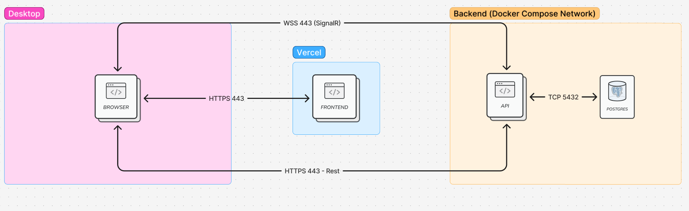
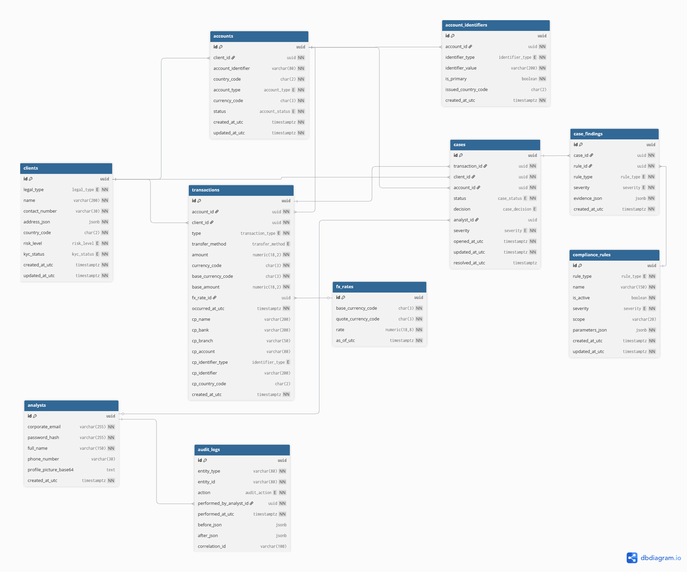

# Projeto 1 - UBS Watchdog: Monitoramento de Transações & Compliance

## Visão Geral

**UBS Watchdog** é um projeto de monitoramento de transações financeiras, com foco em analisar e identificar transações que não seguem as regras de *compliance*. Em outras palavras, a aplicação atua como um “vigia” (*watchdog*) para detectar operações financeiras potencialmente irregulares ou fora dos padrões estabelecidos, auxiliando equipes de compliance a encontrar e investigar essas ocorrências.

## 1. Arquitetura




## 2. Tecnologias Utilizadas

- **Back-end:** .NET 8.0 (C#) - API desenvolvida em ASP.NET Core, responsável pelas regras de negócio e análise de compliance.
- **Banco de Dados:** PostgreSQL - utilizado para armazenar as transações financeiras e demais dados da aplicação.
- **Front-end:** React com TypeScript - interface web para visualizar e interagir com os dados monitorados pelo sistema.
- **Docker:** usado para containerizar a aplicação (tanto back-end quanto banco de dados) e facilitar a configuração do ambiente de desenvolvimento.
- **Outras Dependências:**  Docker Compose (para orquestração dos contêineres do back-end e banco de dados).

## 3. Modelo de Dados (PostgreSQL)



### Entidades principais (visão conceitual)

- **Transactions**: transações financeiras monitoradas (status, valores, timestamps, vínculo com conta/cliente).
- **ComplianceRules**: regras de compliance e seus parâmetros (escopo/condições).
- **Cases**: casos gerados a partir de violações/alertas para investigação.
- **Analysts**: usuários analistas (perfil, permissões/identidade).
- **Clients / Accounts**: clientes e contas associadas às transações.
- **Logs**: trilha/auditoria de eventos relevantes (ex.: ações em casos e regras).
- **Identifiers**: identificadores auxiliares/metadata para correlação (quando aplicável).
- **FxRates**: Taxas de câmbio.


## 4. Métodos e Endpoints

### Account Identifiers

| Método | Endpoint | Descrição |
|------|---------|-----------|
| GET | `/api/accounts/{accountId}/identifiers` | Retorna todos os identificadores de uma conta específica. |
| POST | `/api/accounts/{accountId}/identifiers` | Cria um novo identificador para uma conta. |
| DELETE | `/api/account-identifiers/{identifierId}` | Remove um identificador de uma conta. |

---

### Accounts

| Método | Endpoint | Descrição |
|------|---------|-----------|
| POST | `/api/clients/{clientId}/accounts` | Cria uma nova conta para um cliente. |
| GET | `/api/clients/{clientId}/accounts` | Lista todas as contas de um cliente específico. |
| GET | `/api/accounts/{accountId}` | Retorna os detalhes de uma conta específica. |
| POST | `/api/clients/{clientId}/accounts/import` | Importa múltiplas contas a partir de CSV ou Excel. |

---

### Analysts

| Método | Endpoint | Descrição |
|------|---------|-----------|
| GET | `/api/analysts/{id}` | Retorna o perfil de um analista pelo ID. |
| PATCH | `/api/analysts/me/profile-picture` | Atualiza ou remove a foto de perfil do analista autenticado. |

---

### Audit Logs

| Método | Endpoint | Descrição |
|------|---------|-----------|
| GET | `/api/audit-logs` | Pesquisa logs de auditoria com paginação, filtros e ordenação. |
| GET | `/api/audit-logs/{id}` | Retorna um log de auditoria específico. |

---

### Auth

| Método | Endpoint | Descrição |
|------|---------|-----------|
| POST | `/api/auth/login` | Autentica um analista via email e senha. |
| GET | `/api/auth/me` | Retorna o perfil do analista autenticado. |
| POST | `/api/auth/logout` | Encerra a sessão do analista autenticado. |

---

### Cases

| Método | Endpoint | Descrição |
|------|---------|-----------|
| GET | `/api/cases` | Retorna uma lista paginada, filtrada de casos e ordenada. |
| GET | `/api/cases/{id}` | Retorna os detalhes de um caso específico. |
| PATCH | `/api/cases/{id}` | Atualiza o workflow do caso (status, decisão, responsável). |
| GET | `/api/cases/{caseId}/findings` | Retorna todas as violações (findings) de um caso. |
| POST | `/api/cases/{id}/assign-to-me` | Atribui o caso ao analista autenticado. |

---

### Clients

| Método | Endpoint | Descrição |
|------|---------|-----------|
| POST | `/api/clients` | Cria um novo cliente. |
| GET | `/api/clients` | Lista clientes com paginação, filtros e ordenação. |
| GET | `/api/clients/{id}` | Retorna os detalhes de um cliente específico. |
| POST | `/api/clients/import` | Importa múltiplos clientes via CSV ou Excel. |

---

### Compliance Rules

| Método | Endpoint | Descrição |
|------|---------|-----------|
| GET | `/api/rules` | Lista regras de compliance com paginação, filtros e ordenação. |
| GET | `/api/rules/{id}` | Retorna uma regra de compliance específica. |
| PATCH | `/api/rules/{id}` | Atualiza parcialmente uma regra existente. |

---

### Countries

| Método | Endpoint | Descrição |
|------|---------|-----------|
| GET | `/api/countries` | Retorna todos os países disponíveis (ex.: dropdowns). |
| PATCH | `/api/countries/{code}/risk-level` | Atualiza o nível de risco de um país. |

---

### Exchange Rates

| Método | Endpoint | Descrição |
|------|---------|-----------|
| GET | `/api/exchange-rates/{baseCurrency}/{quoteCurrency}` | Retorna a taxa de câmbio para um par de moedas. |
| GET | `/api/exchange-rates/{baseCurrency}` | Retorna todas as taxas disponíveis para uma moeda base. |
| POST | `/api/exchange-rates/convert` | Converte um valor entre moedas. |

---

### Health

| Método | Endpoint | Descrição |
|------|---------|-----------|
| GET | `/api/health` | Health check da API. |
| GET | `/api/health/db` | Verifica conectividade com o banco de dados. |

---

### Reports

| Método | Endpoint | Descrição |
|------|---------|-----------|
| GET | `/api/reports/client/{clientId}` | Retorna relatório detalhado de um cliente. |
| GET | `/api/reports/system` | Retorna relatório sistêmico (todos os clientes). |
| GET | `/api/reports/client/{clientId}/export/csv` | Exporta relatório do cliente em CSV (streaming). |
| GET | `/api/reports/system/export/csv` | Exporta relatório sistêmico em CSV (streaming). |

---

### Transactions

| Método | Endpoint | Descrição |
|------|---------|-----------|
| POST | `/api/transactions` | Cria uma nova transação. |
| GET | `/api/transactions` | Lista transações com paginação e filtros. |
| GET | `/api/transactions/{id}` | Retorna os detalhes de uma transação específica. |
| POST | `/api/transactions/import` | Importa múltiplas transações via CSV ou Excel. |


## Como Desenvolver, Testar e Buildar para Produção

Primeiramente temos o guia passo a passo de como configurar e executar o projeto **UBS Watchdog** em ambiente de desenvolvimento local, esse abrange as etapas para Windows, Linux e macOS. Inclui instruções para subir o back-end (.NET + PostgreSQL) em contêineres Docker e rodar o front-end React, além de dicas para resolver problemas comuns.


### 1. Pré-requisitos

**Obrigatórios:**
- **Git:** Clonar o repositório.
- **Docker Desktop:** Executar os contêineres (disponível para Windows, macOS ou Linux).
- **Node.js (versão LTS):** Necessário para rodar o front-end em desenvolvimento.

**Opcionais:**
- **.NET SDK 8.0:** caso deseje executar a API fora do Docker (por exemplo, rodar a aplicação .NET diretamente).


### 2. Clonando o repositório

Abra um terminal e execute os comandos abaixo para clonar o projeto e navegar até a pasta do mesmo:

```bash
git clone https://github.com/PedroPauloMorenoCamargo/UBS_Watchdog.git
cd UBS_Watchdog
```

### 3. Instalando o Docker

Siga as instruções de acordo com seu sistema operacional para instalar o Docker (que inclui o Docker Compose):

#### Windows

1. Baixe e instale o Docker Desktop for Windows do site oficial: **Docker Desktop - Windows**
2. Durante a instalação, habilite a opção **WSL 2** se for solicitada (necessária para subsistema Linux no Windows).
3. Conclua a instalação e reinicie o computador, se necessário.

#### macOS

1. Baixe o Docker Desktop for Mac: **Docker Desktop - macOS**
2. Abra o arquivo baixado (.dmg) e arraste o ícone do Docker para a pasta **Applications**.
3. Execute o Docker Desktop e aguarde até que ele finalize o processo de inicialização (o ícone na barra de menu deverá indicar que o Docker está ativo).

#### Linux (Ubuntu/Debian)

Execute os comandos abaixo no terminal para instalar o Docker Engine e o plugin do Docker Compose:

```bash
sudo apt update
sudo apt install -y docker.io docker-compose-plugin
sudo usermod -aG docker $USER
newgrp docker
```

> **Dica:** o comando `usermod` acima adiciona seu usuário ao grupo do Docker para permitir usar o Docker sem `sudo`. Após executá-lo, o comando `newgrp docker` aplica a mudança imediatamente na sessão atual.

#### Verificação da instalação

Após a instalação, verifique se tudo ocorreu bem executando:

```bash
docker --version
docker compose version
```

Esses comandos devem retornar as versões do Docker e do Docker Compose instaladas, confirmando que o ambiente Docker está pronto.

### 4. Subindo o Back-end e o Banco de Dados

No ambiente de desenvolvimento, utilizamos o Docker Compose para levantar simultaneamente o container do banco de dados PostgreSQL e o container da API .NET.

#### 4.1. Criar o arquivo de ambiente `.env`

Antes de iniciar os contêineres, crie um arquivo `.env` na raiz do projeto (UBS_Watchdog) com as variáveis de ambiente necessárias para configurar o banco de dados:

* **Linux/macOS:** no terminal, execute `touch .env`
* **Windows (PowerShell):** execute `New-Item .env`

Em seguida, abra o arquivo `.env` em um editor de texto e adicione o conteúdo abaixo:

```env
POSTGRES_DB=ubs_monitoring_db
POSTGRES_USER=ubs_user
POSTGRES_PASSWORD=ubs_user@1234

EXCHANGERATE_API_KEY=${key}

Jwt_Issuer=ubs-monitoring-api
Jwt_Audience=ubs-monitoring-frontend
Jwt_SigningKey=${signingkey}
Jwt_ExpiresMinutes=60

```

> Caso você queira que a taxa de câmbio funcione corretamente, faça o registro nesse site: [ https://www.exchangerate-api.com/ ] e gere uma API key, após fazer isso, coloque sua API Key em uma váriavel de ambiente .env com o seguinte valor: EXCHANGERATE_API_KEY=${key}

> Esses valores definem o nome do banco de dados (`POSTGRES_DB`), o usuário e a senha do PostgreSQL que serão utilizados no ambiente de desenvolvimento e variáveis de sistema. O Docker Compose utilizará essas variáveis para configurar o container do banco e atribuir constantes a API.

#### 4.2. Subir os contêineres da aplicação

Ainda na raiz do projeto, execute o comando do Docker Compose para construir e iniciar os serviços:

```bash
docker compose up --build
```

(O comando acima funciona da mesma forma no Windows, Linux ou macOS.)

O Docker Compose irá realizar as seguintes ações:

* **Banco de Dados (PostgreSQL):** cria e inicia um container baseado na imagem oficial do Postgres, usando as variáveis definidas no `.env` para criar o banco `ubs_monitoring_db` e o usuário `ubs_user`.
* **API .NET 8:** constrói a imagem Docker do back-end (caso ainda não exista) e inicia um container executando a API. As variáveis de ambiente do arquivo `.env` também serão automaticamente disponibilizadas para este container, de modo que a API possa utilizá-las (por exemplo, para montar a string de conexão com o banco de dados).

Aguarde até que ambos os serviços inicializem. Os logs do terminal mostrarão mensagens do PostgreSQL (configuração do banco) e da API .NET (que deverá informar algo como `Now listening on: http://[::]:8080`, indicando que está de pé na porta 8080).

### 5. Acessando a API no navegador

Com os contêineres em execução, você pode verificar se o back-end subiu corretamente acessando os seguintes endereços em seu navegador web:

* **Swagger UI:** interface de documentação e teste da API. Disponível em `http://localhost:8080/swagger`. Através dela é possível visualizar os endpoints disponíveis e realizar chamadas para testar.
* **Health Check:** endpoint de saúde da aplicação, útil para ver se o serviço está respondendo. Acesse `http://localhost:8080/health` para checar; a API deverá retornar algo como `Healthy` se tudo estiver ok.

> **Observação:** caso esteja executando em um ambiente Linux e não tenha interface gráfica, você pode usar ferramentas como `curl` para acessar esses endpoints (ex.: `curl http://localhost:8080/health`).

### 6. Instalando o Node.js e npm (para o Front-end)

Para executar o front-end React em modo de desenvolvimento, é necessário ter o Node.js instalado na máquina (o npm geralmente vem junto com o Node.js).

* **Windows/macOS:** baixe o instalador da versão LTS do Node.js a partir do site oficial: **Node.js Download - LTS**.
  Execute o instalador e siga os passos. No Windows, marque a opção **“Add to PATH”** durante a instalação para conseguir usar `node` e `npm` no terminal.
* **Linux (Ubuntu/Debian):** você pode instalar via gerenciador de pacotes:

```bash
sudo apt install -y nodejs npm
```

Após a instalação, verifique no terminal/cmd:

```bash
node -v
npm -v
```

Esses comandos devem exibir as versões do Node.js e do npm, indicando que foram instalados corretamente.

### 7. Rodando o Front-end (React + TypeScript)

Com o Node.js disponível, seguimos os passos para instalar dependências e executar a aplicação web em modo de desenvolvimento.

#### 7.1. Acessar a pasta do front-end

No terminal, navegue para o diretório do front-end dentro do repositório clonado:

```bash
cd frontend
```

#### 7.2. Criar o arquivo de ambiente do front-end

Assim como no back-end, o front-end utiliza um arquivo de variáveis de ambiente. Dentro da pasta `frontend`, crie um arquivo `.env`:

* **Linux/macOS:** `touch .env`
* **Windows (PowerShell):** `New-Item .env`

Abra o arquivo `.env` do front-end e adicione a seguinte linha:

```env
VITE_API_BASE_URL=http://localhost:8080
```

Isso configura o endereço base da API para o front-end em desenvolvimento. Como estamos rodando a API localmente na porta 8080 via Docker, o front-end irá se comunicar com `http://localhost:8080`. (Em ambiente de produção, essa URL será alterada para onde quer que a API esteja hospedada - veremos isso na seção de Deploy.)

#### 7.3. Instalar as dependências do projeto front-end

Ainda no diretório `frontend`, instale os pacotes npm necessários executando:

```bash
npm install
```

Este comando irá ler o arquivo `package.json` e baixar todos os pacotes listados (React, etc.) para a pasta `node_modules`.

#### 7.4. Executar o front-end em modo de desenvolvimento

Após concluir a instalação das dependências, inicie o servidor de desenvolvimento do React com:

```bash
npm run dev
```

Este comando iniciará a aplicação React em modo de desenvolvimento. Normalmente, o Vite (bundler utilizado) abrirá automaticamente um endereço local (por padrão `http://localhost:5173`) no navegador. Caso não abra automaticamente, você pode acessá-lo manualmente.

### 8. Acessando a Aplicação Web

Com o front-end rodando (passo anterior), abra seu navegador e visite:

* **Aplicação Web (Interface do UBS Watchdog):** `http://localhost:5173`

Você deverá ver a interface do UBS Watchdog carregada. A aplicação web irá consumir os dados da API (rodando em `http://localhost:8080`) para exibir informações de transações e possíveis violações de compliance em tempo real durante o desenvolvimento.
Para efetuar o login deve-se usar as credenciais:
login: admin@ubs.com
senha: admin123

### 9. Encerrando os Serviços

Quando terminar de usar o ambiente de desenvolvimento, é importante desligar os serviços para liberar recursos do sistema.

#### 9.1. Encerrando Back-end e Banco de Dados (Docker)

No terminal onde o Docker Compose está em execução (aquele em que você rodou o `docker compose up`), interrompa a execução pressionando `Ctrl + C`. Em seguida, para garantir que nenhum container continue rodando em segundo plano, execute na raiz do projeto:

```bash
docker compose down
```

Este comando irá parar e remover todos os contêineres iniciados pelo Compose. Os volumes do Docker (por exemplo, os dados do PostgreSQL) são preservados, assim você não perde os dados inseridos no banco entre execuções, a menos que opte por removê-los manualmente.

#### 9.2. Encerrando o Front-end (React)

Se o servidor de desenvolvimento do React (`npm run dev`) estiver ativo, vá até o terminal onde ele está rodando e pressione `Ctrl + C` para interrompê-lo. Isso encerrará o servidor local do front-end.


## 10. Executando os Testes Automatizados (Pytest)

Os testes automatizados do **UBS Watchdog** tem como objetivo manter a integridade da aplicação e ficam na pasta `tests/`, sendo executados via **Python + pytest**.  
**Importante:** os testes assumem que o **back-end** e o **PostgreSQL** estão rodando (via Docker Compose).

### 1) Subir o Back-end + Banco (Docker Compose)

Em um terminal, na **raiz do repositório**, suba os containers e mantenha esse terminal aberto:

```bash
docker compose up --build
```

A API deve ficar disponível em `http://localhost:8080` (ex.: `http://localhost:8080/health`).

### 2) Criar/ativar o ambiente virtual Python e instalar dependências

Em **outro terminal**, vá para a pasta de testes:

```bash
cd tests
```

Crie e ative o ambiente virtual:

**Linux/macOS:**

```bash
python3 -m venv .venv
source .venv/bin/activate
```

**Windows (PowerShell):**

```powershell
python -m venv .venv
.\.venv\Scripts\Activate.ps1
```

Instale as dependências do arquivo `tests/requirements.txt`:

```bash
pip install -r requirements.txt
```

### 3) Configurar variáveis 

> Observação: como os testes dependem do Compose em execução, a URL típica da API em ambiente local é `http://localhost:8080`.

### 4) Executar os testes com pytest

Ainda dentro da pasta `tests/` (com o `.venv` ativado) para rodar todos os testes:

```bash
pytest -v
```

Opcionalmente, para rodar um arquivo específico:

```bash
pytest -v test_health.py
```


## 11. Deploy para Produção

Após testar o projeto localmente, você pode desejar implantar (*deploy*) a aplicação em ambiente de produção. A seguir, mostramos como realizar o deploy do back-end utilizando o **Railway** (plataforma de hospedagem de aplicativos e bancos de dados) e do front-end utilizando o **Vercel** (plataforma de hospedagem de aplicações front-end/serverless).

> **Nota:** existem várias formas e serviços para hospedar aplicações. Railway e Vercel são apenas sugestões que se integram bem a projetos Docker/.NET e React, respectivamente. Sinta-se à vontade para usar serviços de sua preferência; porém, os passos abaixo ilustram o processo nesses provedores.

### 12.1. Deploy do Back-end no Railway

O **Railway** é uma plataforma que permite hospedar aplicações (como uma API .NET) e bancos de dados (como PostgreSQL) com configuração centralizada de variáveis de ambiente e *connection strings*.

Nesta solução, o deploy do back-end foi feito criando uma **branch dedicada chamada `deploy`**, com ajustes para facilitar o build e a execução diretamente pelo Railway:

- **Remoção do arquivo `.env` e variáveis locais** (as variáveis passam a ser configuradas diretamente no Railway).
- **Configuração das variáveis e da connection string no painel do Railway**, incluindo a string de conexão do PostgreSQL.
- **Reorganização do repositório na branch `deploy`:** o conteúdo da pasta `backend` foi movido para a **raiz do repositório**, permitindo que o Railway detecte e execute o projeto diretamente sem precisar apontar para subpastas.

#### Passo a passo

1. **Criar conta e novo projeto**
   - Acesse `railway.app`, crie uma conta (preferencialmente via GitHub) e clique em **New Project**.

2. **Conectar o repositório GitHub na branch `deploy`**
   - Selecione deploy via GitHub, autorize o acesso e conecte o repositório:
     - `PedroPauloMorenoCamargo/UBS_Watchdog`
   - Selecione a **branch `deploy`** (em vez da `DEV` ou `main` ), pois ela contém a estrutura ajustada para produção.

3. **Adicionar PostgreSQL no Railway**
   - O railway não implementa suporte para `docker-compose`,sendo assim, dentro do projeto no Railway, adicione o plugin de banco:
     - **Add Plugin -> PostgreSQL**
   - Isso provisionará um banco gerenciado e exibirá credenciais/URL de conexão.

4. **Configurar variáveis de ambiente no Railway**
   - No serviço do back-end, vá até **Variables** e configure as variáveis necessárias **diretamente no painel**.
   - Nesta estratégia, o projeto **não depende de `.env`** em produção.

5. **Configurar Connection String no Railway**
   - Ainda no painel do Railway, configure a **connection string** do banco (PostgreSQL) por lá, usando:
     - a URL do banco do Railway **ou**
     - os campos separados (host/user/pass/db/port), conforme seu setup no back-end.

6. **Deploy**
   - Com a branch `deploy` conectada e variáveis configuradas, o Railway fará o build e iniciará a aplicação.
   - Acompanhe os logs do deploy no painel para validar inicialização e conexão com o banco.

7. **Domínio público da API**
   - Com o serviço rodando, o Railway fornecerá um domínio público (ex.: `https://<app>.up.railway.app`).
   - Use esse domínio para configurar o front-end (ex.: `VITE_API_BASE_URL` no Vercel).

8. **Teste em produção**
   - Verifique:
     - `<seu-domínio>/swagger`
     - `<seu-domínio>/health`


### 13.2. Deploy do Front-end no Vercel
---


